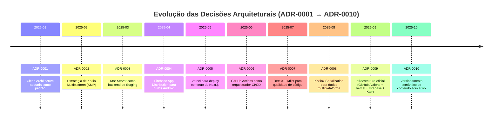

# 🕑 Linha do Tempo dos ADRs

---

## 🔍 Explicação

- Cada ADR é representado como um marco na linha do tempo.
- Mostra a **progressão lógica** das decisões: começando pela arquitetura (ADR-0001), passando por tecnologias core (KMP, Ktor, Firebase, Vercel), até chegar em práticas de qualidade e gestão de conteúdo.
- Facilita onboarding de novos devs e dá clareza sobre **quando e por que** cada decisão foi tomada.

---

## 🎯 Resultado

- O diagrama Mermaid pode ser renderizado diretamente no GitHub.
- Documenta visualmente a evolução das decisões arquiteturais.
- Completa o índice consolidado (`docs/adr/index.md`) com uma visão temporal.

---
