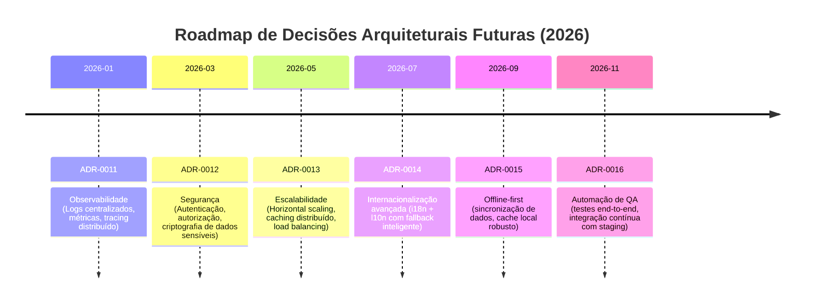

# 🛣️ Roadmap Futuro de ADRs (2026)

---

## 🔍 Explicação

- **ADR-0011 (Observabilidade):** definir padrões para logs centralizados, métricas e tracing distribuído.
- **ADR-0012 (Segurança):** autenticação, autorização e criptografia de dados sensíveis.
- **ADR-0013 (Escalabilidade):** estratégias de scaling horizontal, caching distribuído e balanceamento de carga.
- **ADR-0014 (Internacionalização avançada):** suporte completo a i18n/l10n com fallback inteligente.
- **ADR-0015 (Offline-first):** garantir que o app funcione mesmo sem conexão, com sincronização posterior.
- **ADR-0016 (Automação de QA):** testes end-to-end e integração contínua com staging.

---

## 🎯 Resultado

- O roadmap mostra **possíveis ADRs futuros** além do ADR-0010.
- Dá clareza sobre **prioridades arquiteturais para 2026**.
- Facilita planejamento estratégico e alinhamento da equipe.

---
